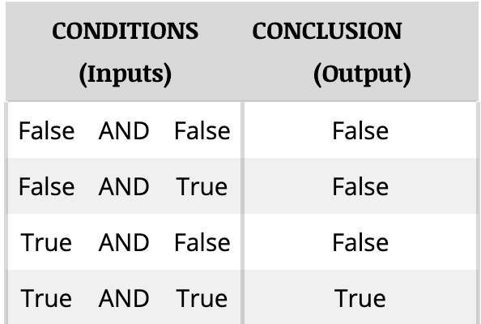
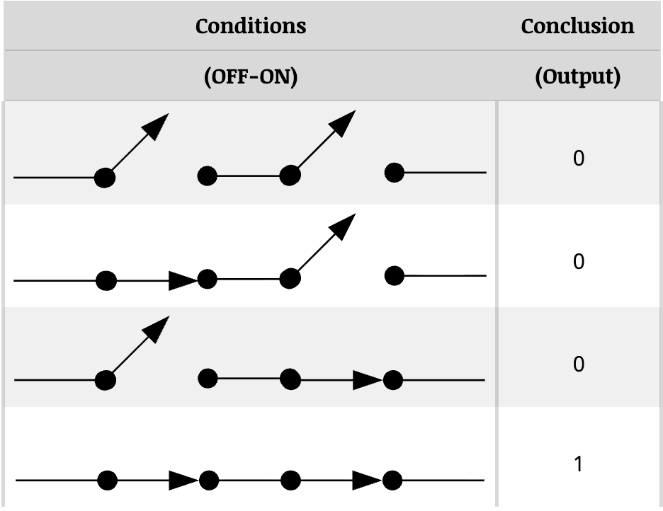
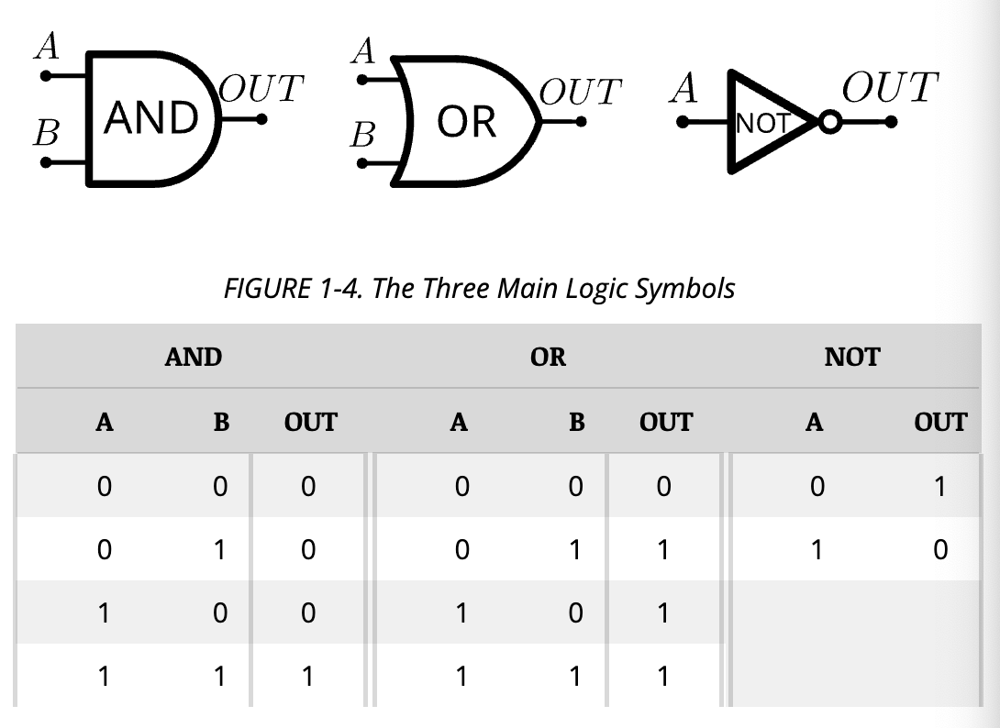
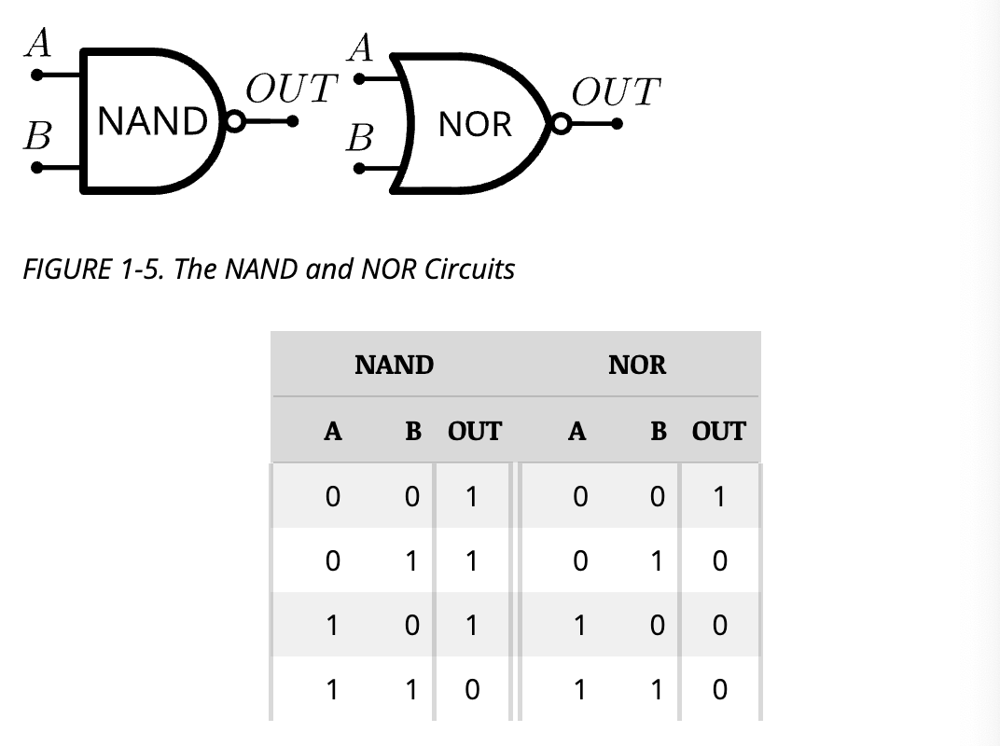
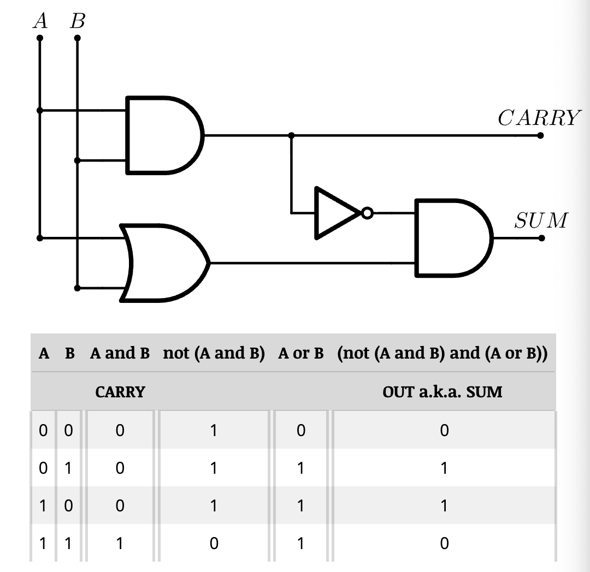
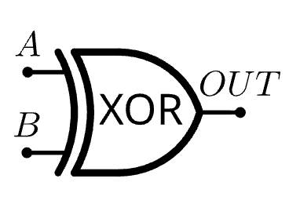

# Altair Manual Notes - Part One

## Part 1 Introduction
- The Altair 8800 is the most economical computer
- The heart of an Altair 8800 is Intel Corporation's Model 8080 Microcomputer 
    - A complete CPU on a single silicon chip
- The Altair has 78 machine language instructions
- The Altair is capable of preforming several operations that aren't usually available with conventional mini-computers

## Logic
- George Boole is a 19th century British mathematician
- Boole showed how any logical statement can be analyzed with simple arithmetic relationships
    - He did not equate mathematics with logic
- All practical digital computers and other electronic circuits are based upon the logic concepts explained by Boole
    - His 1847 booklet *The Mathematical Analysis of Logic*
- Boole's system of logic (Boolean algebra) assumes that a logic condition or statement is either true or false
    - Cannot be both and cannot be partially true or partially false
- An electronic analogy of a logical statement can be readily synthesized
- It is possible to devise electronic equivalents for AND, OR, and NOT
    - AND: true only if **all** of its logic conditions are true
    - OR: true if **any** of its logic conditions are true
    - NOT: reverses the meaning of a logic statement (i.e.: true to false and false to true)
- A switch ON is true and OFF is false
    - A switch OFF will not pass an electrical current, therefore it can be assigned a numerical value of 0
    - A switch ON will pass an electrical current, therefore it can be assigned a numerical value of 1
- Various permutations for a two condition AND statement:
    

- Electronic ON-OFF switch equivalent:
    

## Electronic Logic 
- The three basic logic functions can be implemented by simple transistor circuits 
    - Each circuit is assigned a symbol to assist in designing logic systems. 
    - The three symbols and their truth-tables: 
    
- The three basic logic circuits can be combined to produce more logic analogies such as NAND (NOT-AND) and NOR (NOT-OR)
    - These are considered basic logic circuits and have their own logic symbols and truth tables:
    
- Three or more logic circuits make a logic system. 
    - Most basic logic system is the EXCLUSIVE-OR circuit: 
    
        
    - The EXCLUSIVE-OR circuit can be used to implement logical functions, but also to ass two input conditions
        - EXCLUSIVE-OR circuit is called a binary adder 
        - When referring to an Exclusive OR (XOR) the CARRY is ignored and graphically represented as: 
        
- Two NAND circuits can be connected to form a bistable circuit called a flip-flop
    - A flip-flop changes states only when an incoming signal in the form of a pulse arrives, therefore it acts as a short term memory element
- Other logic circuits can be connected together to form monostable and astable circuits
    - Monostable circuits occupy one of two states unless an incoming pulse is received
    - Astable circuits continually switch back and forth between two states

## Number Systems
- Dual-state electronic circuits are highly compatible with a two-digit number system 
    -These digits are called bits (binary digits)
- Systems based upon eight and sixteen are also compatible with complex electronic logic systems such as computers

## The Binary System 
- The Altair 8800 preforms nearly all operations in binary
    - A typical binary number processed by the compyter incorporates 8-bits and may appear as: *011001100110*
        - A fixed length binary number is usually called a word or byte
- Counting in any number system is governed by one basic rule: Record successive digits for each count in a column. When the total number of available digits has been used, begin a new column to the left of the first and resume counting
- Each bit in a binary number indicated by which power of two the number is to be raised

