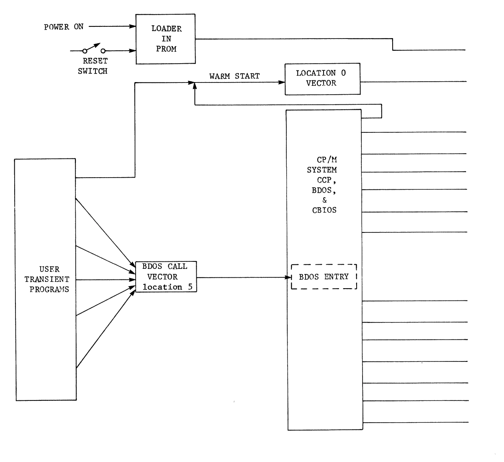
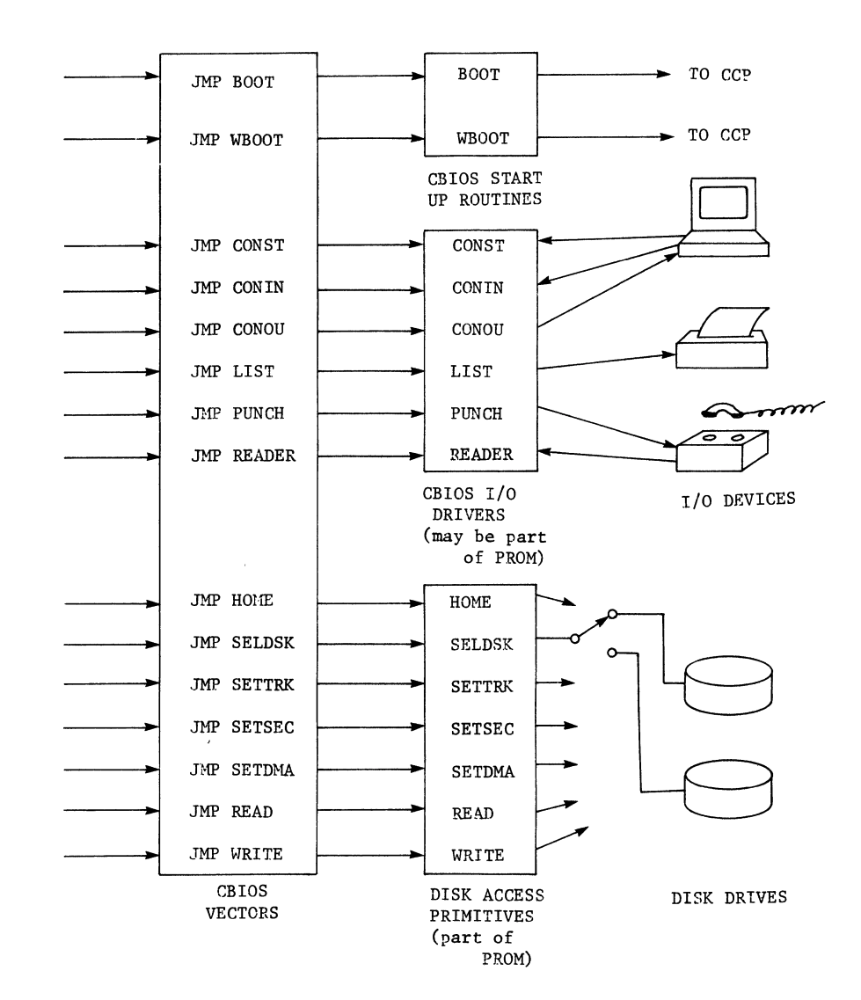
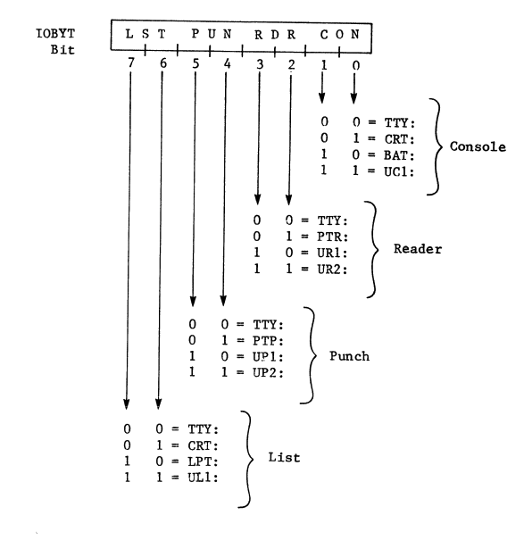

# CP/M Chapter 5

## Organization of CP/M
- Items the operating system needs:
    - Access to programs at the most primitive level
        - Communicates with the physical devices through the computer hardware
    - Needs to be supplied driver routines before CP/M can run

## Disk and I/O access primitives:
- The loader program somewhere in ROM is used to load the operating system into the proper place in RAM
    - This loader isn't a part of the operating system
        - needs to pre-exist somewhere in the computer's memory to get the operating system off the disk and into memory
    - The loader must be available when the power is first turned on and when the operator hits the RESET switch
    - This same loader, or some portion of it, will be used to 'warm start' the operating system
        - A warm start assumes that the system has been running previously
            - Will use the currently selected disk drive and make no changes in the logical to physical device mapping defined by the contents of the IOBYT
            - Used at the end of transient programs to reload CP/M or in response to the operator pressing CTRL C to abort the program
- PROM based loader must contain routines that permit accessing the disk at the most primitive level, in order to position the head of the correct disk drive to the correct track and sector where the beginning of the operating system will be found, and then load the system into RAM
- The same routines will later be used by the operating system to preform the same primitive functions
- When adapting the CP/M to a particular computer, you need to connect the proper functions in CP/M to the proper disk access primitives in PROM
    - The same is true for I/O device accesses
    - CP/M doesn't know the absolute address of all the I/O ports, so computer specific set of I/O device driver routines is required
    - Since no communication with the CON: or other devices is required before the system is loaded into RAM, it is customary to include the complete I/O device access primitives within the proper area set aside in CP/M, in the Customized Basic Input/Output system (CBOIS)
        - These driver routines will then be loaded from the disk along with the CP/M
- A particular area within the operating system has been set aside for a number of vectors that point to the proper disk and I/O primitives 

- Table 5.1 (the vectors mentioned above):

| ADDRS   | Vector | Description/Functions                                                                                                                                                             |
|---------|--------|-----------------------------------------------------------------------------------------------------------------------------------------------------------------------------------|
| 3E00H+b | BOOT   | Enter after power on or RESET and after system has been loaded from disk. Display sign-on message, zero IOBYT and DRIVE, set up low RAM vectors, select current drive, go to CCP. |
| 3E03H+b | WBOOT  | Enter after CTRL C or JMP 0. Load system from disk. Set up low RAM vectors, select current drive, go to CCP.                                                                      |
|**I/0 Device Drivers**|**I/0 Device Drivers**|
| 3E06H+b | CONST  | Test CON: for keyboard character ready.                                                                                                                                           |
| 3E09H+b | CONIN  | Wait for and read CON: keyboard character.                                                                                                                                        |
| 3E0CH+b | CONOUU | Send one character to CON: display.                                                                                                                                               |
| 3E0FH+b | LIST   | Send one character to LST: device.                                                                                                                                                |
| 3E12H+b | PUNCH  | Send one character to PUN: device.                                                                                                                                                |
| 3E15H+b | READER | Wait for and input one RDR: character.                                                                                                                                            |
|**Disk Access Primitives**|**Disk Access Primitives**|
| 3E18H+b | HOME   | Set current drive head to track 0.                                                                                                                                                |
| 3E1BH+b | SELDSK | Select drive, store number in DRIVE.                                                                                                                                              |
| 3E1EH+b | SETTRK | Set current drive head to track specified.                                                                                                                                        |
| 3E21H+b | SETSEC | Seek current drive to sector specified.                                                                                                                                           |
| 3E24H+b | SETDMA | Set RAM buffer start address for next disk read or write.                                                                                                                         |
| 3E27H+b | READ   | Read selected disk, track, sector into RAM buffer.                                                                                                                                |
| 3E2AH+b | WRITE  | Write contents of RAM buffer into selected disk, track, sector.                                                                                                                   |

- b = BIAS = 400H for each 1K offset above 16K CP/M
- Each vector is a 3 byte jump instruction
    - Examples: JUMP BOOT, JMP WBOOT
- The addresses above are the absolute addresses for the 16K version of CP/M
- The first vector points to routines that get things running after the PROM loader has bootstrapped in the CP/M system and will be jumped from the PROM Loader
- First vector points to BOOT then WBOOT for warm starts
    - WBOOT is entered when the operator or a transient program wants the system reloaded
- CP/M is activated when the Console Command Processor (CCP) is entered
    - CPP prompts with `<` character then waits for a command to be entered from the CON: device
- CPP, portions of CP/M and TPA will all communicate with I/O devices through the next six vectors (in the table)
    - These vectors point the driver subroutines that do the decoding of IOBYT and preform the actual communications between software and physical devices
- Everything can be done to a disk can be accomplished through these vectors and the primitive routines that they access
- All that is required to adapt CP/M to a new computer:
    - Provide the loader in PROM and the 15 routines to be accessed through these vectors

## BDOS - The Basic Disk Operating System
- The basic element of disk storage is the 128 byte record
    - Because the floppy disk sector held 128 bytes of data plus address and checksum info

| Unit     | Size (bytes) | extra     |
|----------|--------------|-----------|
| 1 record | 128 Bytes    |           |
| 1 Block  | 256 bytes    | 2 records |
| 1 group  | 8 records    | 1K bytes  |

- **File Control Block (FCB)** contains information about the file such as the name, where it is, and how big it is
- The minimum increment of space on the disk that can be allocated by CP/M is not only one record but is the 1K byte group
    - If a file contains a single byte it still takes up 1K bytes on the disk
    - If 1K + 1 it will take up 2K of disk space
- BDOS takes of the little details
    - Remembering what files have been erased so space on the disk can be reused
        - Dynamic disk space allocation
    - Maintains all information required for this in the FCBs in the directory
- Working through PIP or CCP can ask BDOS for the same services\
- `BDOS ERR ON B: BAD SECTOR`: likely a human error
- You can ignore read errors in text files and recover the rest of the file
    - Don't ignore read errors when loading a program from a .COM file
        - Usually fatal error
- `BDOS ERR ON R: SELECT`: means your program is totally lost and has garbaged the DRIVE select byte at location 4 in RAM
    - Hit the reset button!
- BDOS error of READ ONLY means that the disk you are trying to write on is write protected or that you changed the disk without letting CP/M know

## CBIOS - The Customized Basic Input/Output System
- CP/M is compact and easy to adapt to a new hardware environment
- The system was written to run on a minimum computer with only 16K bytes of RAM required for version 1.4 of CP/M
- Access to all disks and I/O devices can be made through a single location 5 vector pointing to the BDOS entry point
    - all other required vectors are grouped in one place
    - more memory space is available above them for the incorporation of the customized drivers that make CP/M run on your particular hardware 
- BIAS is a value that will be added to the absolute addresses shown for versions of CP/M larger than 16K
- The program can be resized from 16K to 64K in 1K increments 
- Table 5-2:
    - b = BIAS = 400H for each 1K offset above 16K CP/M

| Memory From | Address To | Contents                          | Function               |
|-------------|------------|-----------------------------------|------------------------|
| 0000H       | 0002H      | JMP WBOOT at 3E00H+b              | Warm start vector      |
| 0003H       |            | IOBYT                             | I/O selector           |
| 0004H       |            | DISK                              | Disk selector          |
| 0005H       | 0007H      | JMP BDOS at 3106H+b               | BDOS entry vector      |
| 0008H       | 0037H      | not used by CP/M                  | Interrupt vectors      |
| 0038H       | 003AH      | JMP DDT                           | DDT breakpoint         |
| 003BH       | 005BH      | not used by CP/M                  |                        |
| 005CH       | 007FH      | TFCB                              | Transient FCB          |
| 0080H       | 00FFH      | TBUFF                             | Default RAM buffer     |
| 0100H       | 28FFH+b    | TPA                               | Transient programs     |
| 2900H+b     | 30FFH+b    | CCP                               | Console commands       |
| 3100H+b     | 3DFFH+b    | BDOS                              | Disk operations        |
| 3E00H+b     | 3E2CH+b    | CBIOS vectors                     | See Table 5-1          |
| 3E00H+b     | 3FFFFH+b   | CBIOS                             | I/O operations         |

- Each driver will have to decode its part of IOBYT if this feature is enabled on your computer
- Another option with CP/M 
    - The IOBYT does not have to be used if multiple I/O devices are not installed
- If IOBYT is implemented it takes the format shown below

- Each of the four logical devices use a two-bit field within IOBYT to select one of four physical devices
    - Each logical device driver will have to read the current IOBYT, mask out its two bits, and decode the bits to see which device to communicate with
- List of devices shown by `STAT VAL:` doesn't include MOD: (for modem)
    - response of `STAT VAL:` is produced by the CP/M transient utility program STAT
- A customized driver has to be incorporated in CBOIS, and the operator has to remember which name refers to the modem
- BAT: on MDS was the paper tape reader loaded up with a tape full of pre-punched console commands 
- CP/M doesn't use batch mode but has a smarter version called SUBMIT
    - Reads commands from a disk file and does all kinds of smart things

## CCP - The Console Command Processor
- Once the CP/M has been loaded into RAM from the disk, CCP prompts the operator by displaying the currently selected drive and a greater than symbol `A>`
- CCP expects to see a command of one of the resident functions or the filename of a .com file
- A resident function or .COM program could require options to be specified
    - Options can be other file names, ambiguous or unambiguous, w or w/o drive designators
    - Options can be any other information required
    - CCP executes resident commands using the options specified
- If the command is not a residential command, the CPP assumes it is the name of a .COM file
- CPP aids the author of that transient program by setting up a default file control block
    - Contains the properly formatted names of any files specified in the command line 
- An example: COMPARE uses the CPP generated default file control block (TFCB) to find the two filenames that a program requires, since another option can be specified, COMPARE will look in the command line buffer (TBUFF) to find the option

## Resident Functions 

| Command | Description |
|---------|-------------|
| **Resident Commands** | |
| `ERA FILENAME.TYP (afn)` | Erase file(s) |
| `DIR` | Display disk directory |
| `DIR FILENAME.TYP (afn)` | Display directory file(s) |
| `REN FILENAME.TYP=FILENAME.TYP` | Rename a file |
| `SAVE xx FILENAME.TYP` | Save contents of TPA on disk |
| `TYPE FILENAME.TYP` | Display contents of a file |
| **Transient Commands** | |
| `STAT` | Display status of current disk |
| `STAT FILENAME.TYP (afn)` | Display status of file(s) |
| `STAT VAL:` | Display logical/physical I/O |
| `STAT DEV:` | Display I/O assignments |
| `ED FILENAME.TYP` | Edit an ASCII file |
| `ASM FILENAME.shp` | Assemble a program from file |
| `LOAD FILENAME` | Load .HEX file to .COM file |
| `DUMP FILENAME.TYP` | Display file in memory dump format |
| `SUBMIT FILENAME x,y,z` | Submit batch processing |
| `MOVCPM yy w` | Generate re-sized system |
| `SYSSEN` | Write moved system to disk |

- **(afn)** = ambiguous file name(s) permitted
- **xx** = size of file in 256 byte blocks
- **shp** = disk drive for source, hex, and print files
- **x,y,z** = optional parameters
- **yy** = size of resulting CP/M system
- **w** = * option

- Resident functions are not loaded from the disk, they are executed rapidly, but take up memory space
- `DIR` used to display your files on disk
- `ERA` clear disk/ erase
- `SAVE` will create a .COM file by moving the contents of the TPA onto disk with the name specified
- `REN` allows you to rename a file - wants new name then old name = `REN B:NEWNAME.COM=B:OLDNAME.COM`
- `TYPE` requires an unambiguous file name as an option, and will type out the contents of the file
- `CTRL P` is a toggle, enter it once and everything that is output to the console for display will be echoed to the LST: device as well
    - Hit it again and the LST: output will stop

## Transient Utilities
- `STAT` is not a resident function because it is too big 
    - How you check how much space is left on your disk
- `STAT DEV:` will show the current assignments as programmed into the IOBYT
    - `STAT` is also used to change those assignments in systems using the IOBYT
- Assigning another device to CON: will cause your current console device to go dead as soon as STAT makes the assignment

## User Programs
- Transient utilities are .COM files that are loaded into the TPA for execution
- Transient commands just means that they are .COM files on the system disk
