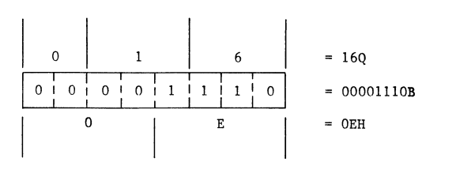
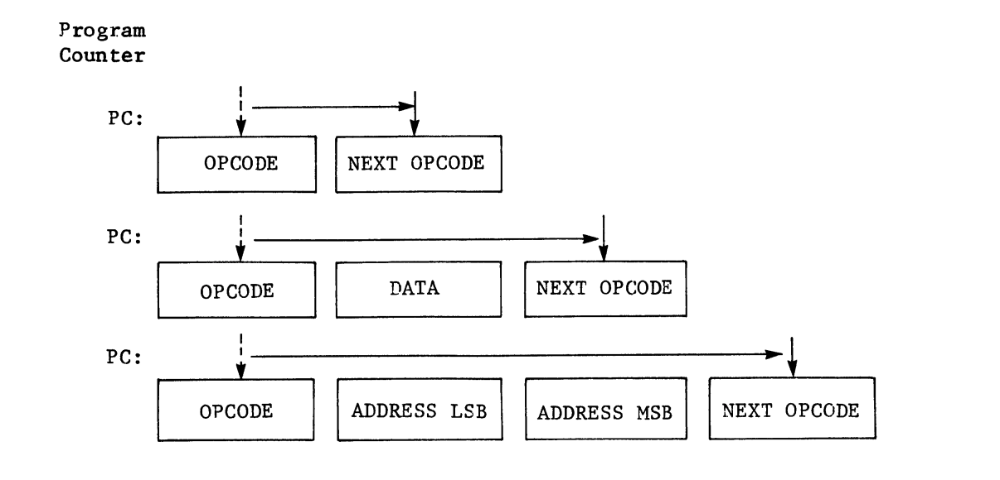

# CP/M Chapter 7

## Machine Language
- Binary digits can assume one of two states: either of two voltage levels
- The language of the machine is composed of patterns of voltages that take one of the two possible binary states
- The computer begins each introduction cycle by fetching an opcode from memory
    - The eight-bit pattern is placed in the instruction register
        - In the storage elements in this register, each bit will be at a high or a low level depending on the instruction
            - This set of eight voltages is the language the machine understands
- Voltage representations:
    - Low level state = `0`
    - High level state = `1`
- Binary, Octal, and Hex relationship:

- Program Counter:

- A machine language program will have more bytes in it than there are lines of code in the assembly language program that produced it

## Assembly Language
- Disassembling: the mental translation from hex code to the assembly langauge mnemonic 
- ORG: a 'pseudo-operation' because it does not translate into a machine language operation
    - Is a directive
- `LOAD` is used to read the `.HEX` file and produce a `.COM` file and return to CPP

